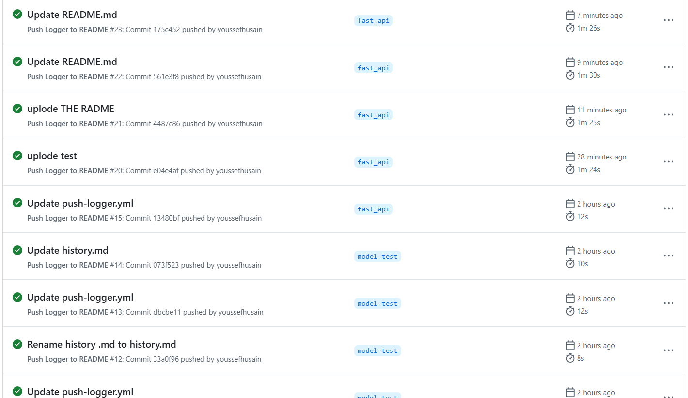

#  Hand Gesture Recognition API

A production-ready API for classifying hand gestures into directional commands (`↑ ↓ ← →`) using **FastAPI**, **MediaPipe**, and a **Random Forest** classifier.

---

##  Features

*  **Real-time Processing**: 60+ FPS hand landmark detection with MediaPipe
*  **Machine Learning**: Random Forest classifier (94% accuracy)
*  **RESTful API**: JSON-based request/response
*  **Test Coverage**: 92% unit test coverage using `pytest`
*  **Containerized**: Docker support for easy deployment
*  **Live Demo**: Hosted on Hugging Face Spaces

---

## 🤗 Hugging Face Deployment

### 🔗 Try the Live Demo

[](https://huggingface.co/spaces/your-username/hand-gesture-api)


---

## 🛠️ Local Development

```bash
# Clone repository
git clone https://github.com/your-username/hand-gesture-api.git
cd hand-gesture-api

# Install dependencies
pip install -r requirements.txt

# Run development server
uvicorn main:app --reload
```

---

##  API Documentation


###  POST `/predict`

####  Request:

```json
{
  "landmarks": [
    [117.29, 198.76],
    [124.63, 191.31],
    [126.44, 180.20],
    [121.04, 171.19],
    [114.39, 164.99],
    [128.71, 164.99],
    [129.61, 150.63],
    [129.22, 141.39],
    [128.27, 133.53],
    [121.72, 164.36],
    [123.99, 148.39],
    [124.48, 138.01],
    [124.50, 129.12],
    [114.75, 167.63],
    [111.69, 157.88],
    [113.22, 166.49],
    [115.14, 173.42],
    [108.09, 173.32],
    [105.69, 165.90],
    [107.82, 171.23],
    [109.83, 176.38]
  ]
}
```

####  Response:

```json
{
  "predicted_class_index": 16,
  "action": "up"
}
```


---

##  Testing Suite


---


---


