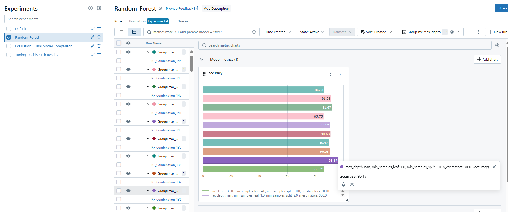
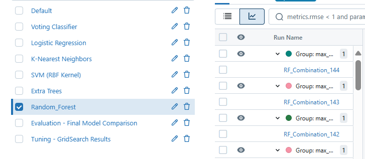

# docker readme

---

# Churn Prediction System

This repository contains the implementation and deployment details of a churn prediction system. The system uses machine learning models to predict customer churn and provides insights through monitoring and visualization tools.

## Table of Contents
- [Overview](#overview)
- [Deployment](#deployment)
- [Docker Image Details](#docker-image-details)
- [Monitoring with Grafana](#monitoring-with-grafana)

## Overview

The churn prediction system is designed to analyze customer data and predict which customers are likely to churn. It leverages machine learning models and is deployed as a Docker container for scalability and ease of maintenance.

## Deployment

The system is deployed using Docker, and the deployment status can be monitored via the platform interface. Below is a snapshot of the deployment dashboard:

Key points:
- **Service Name**: `churn-prediction`
- **Status**: Active
- **Replicas**: 1
- **Region**: EU West

## Docker Image Details

The Docker image used for deployment is built and managed on Docker Hub. Below is a snapshot of the image details:

Key details:
- **Repository**: `youssefs7s/churn-prediction`
- **Tag**: `latest`
- **Architecture**: `linux/amd64`
- **Size**: 587.69 MB
- **Last Pushed**: 6 minutes ago

## Monitoring with Grafana

Grafana is used for monitoring the performance and metrics of the churn prediction system. Below is a snapshot of the Grafana dashboard:

Key metrics displayed:
- Time series data for model performance
- Distribution of predictions
- Key performance indicators (KPIs)

